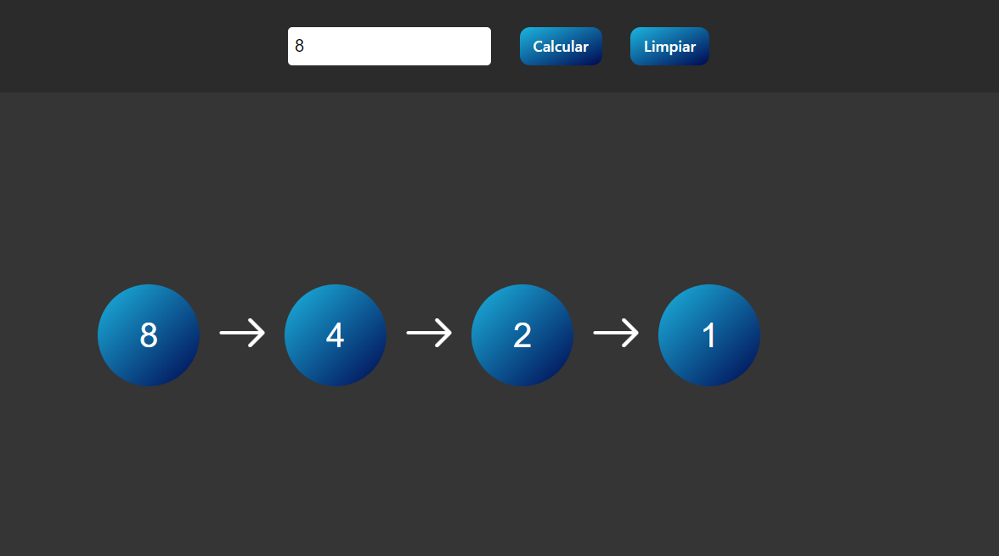

# Collatz-Conjecture

## Simulator of the Collatz Conjecture 

[Simulador](https://rubenfern.github.io/Collatz-Conjecture/)

The Collatz Conjecture was stated by mathematician Lothar Collatz in 1937, and to date has not been solved.

The conjecture states that by entering any positive integer and performing the operations:

```
If the number is even, it divides by 2.
If the number is odd, multiply by 3 and add 1.
```

You will always arrive at the number 1.

